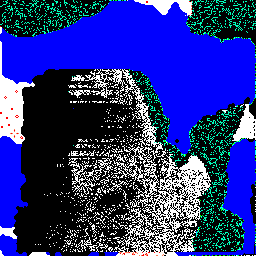
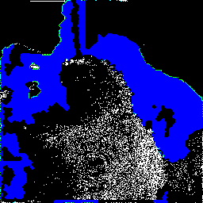
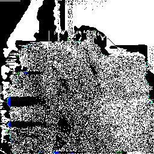
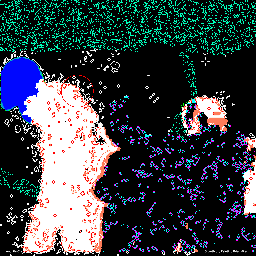
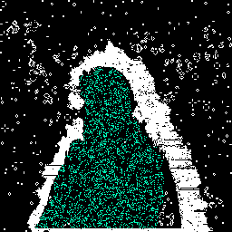
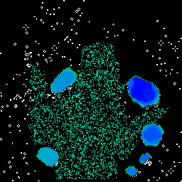
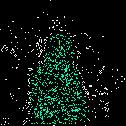

# Memento Mori

This repository is a meditation on death.

Not the resulting computer program, the project itself.

<figure>
	<blockquote>
		<p>
			The water in your body is just visiting.<br>
			It was a thunderstorm a week ago.<br>
			It will be an ocean soon enough.<br>
			Most of your cells come and go like morning dew.<br>
			We are more weather pattern than stone monument.<br>
			Sunlight on mist. Summer lightning.<br>
			Your Choices outweight your substance.
		</p>
	</blockquote>
	<figcaption>
		<p>Anderson, Jarod. "Naming the River." <em>Field Guide to the Haunted Forest</em>, Crooked Wall Press, 2020. p. 6.</p>
	</figcaption>
</figure>

I wanted to make art about death that reflects how I see life. The summarized version is:
* Life is chaos that cleverly shapes *itself* into something that looks orderly, but isn't.
* Life is a ~highway~ pattern. Chaotic systems can fall into patterns without being ordered.
* Actual order is death. A thing that is stable can't break out of a cycle.
* Life is more the signal than the medium (the same way that music travels on sound through the air, but music is not the air).
* Life is a wave that travels through matter.
* Like any wave that carries a signal, not only can the signal fade, but it can be completely lost in noise. Both of these are kinds of deaths.

I take inspiration from two videos.

A few years ago, I crossed paths with this video on a social media feed, part of the Journey to the Microcosmos series: [This Ciliate is About to Die (YouTube)](https://www.youtube.com/watch?v=ibpdNqrtar0). It's 10 minutes long. I found it moving. It explores death, and by contrast what constitutes life. The video focuses on a specific theme, a definition of life as a system that uses its energy to keep itself from reaching equilibrium, and the complementary definition of death as the moment when the system stops working. Given how I think about life, I didn't need convincing to believe this.

Some time later, on that same social media feed, I stumbled upon [Don Hopkins's CAM6 Demo (YouTube)](https://www.youtube.com/watch?v=LyLMHxRNuck), a video in which Don Hopkins, with overflowing enthusiasm, demonstrates his web browser simulator for the [Cam-6](https://en.wikipedia.org/wiki/Cam-6). The Cam-6 is a computer expansion board from the 1980s, designed to run [cellular automata](https://en.wikipedia.org/wiki/Cellular_automata). Don's narration doesn't slow down for such trivialities as "what is a cellular automaton?", and his focus never stays in the same place long enough to explain much anyway, but one thing you need to know about me is that I love anyone eagerly talking shop about something they love.

The important part comes 5 minutes in, when Don says "[Rudy Rucker](https://www.rudyrucker.com) came up with a nifty idea of combining Brian's Brain together with Life and one called Anneal…", and I saw a visual metaphor of organism taking in energy from an environment while shedding itself back into that environment, and I began to draw some parallels.

I want to think a bit about systems that make patterns out of chaos without taming it, and the semi-arbitrary distinctions that most of us make between life and death, between "somethings" that are a part of a system and other "somethings" that aren't part of a system, and the moment when we change our determination about what is or isn't alive.

I also want to make art that River would have loved to watch while stoned out of their mind. So here we are.

## Experiments in dissolving myself

### Variations on a theme











## How to run this program

You can't, because I haven't released `rust-nite2`. Sucks to be youuuu

## Notes for me

```bash
gifsicle --delay 10 --loop --resize 256x_ --resize-method sample memento-mori_*.gif > "mm-$(date +%Y%m%d_%H%M%S).gif"
```
